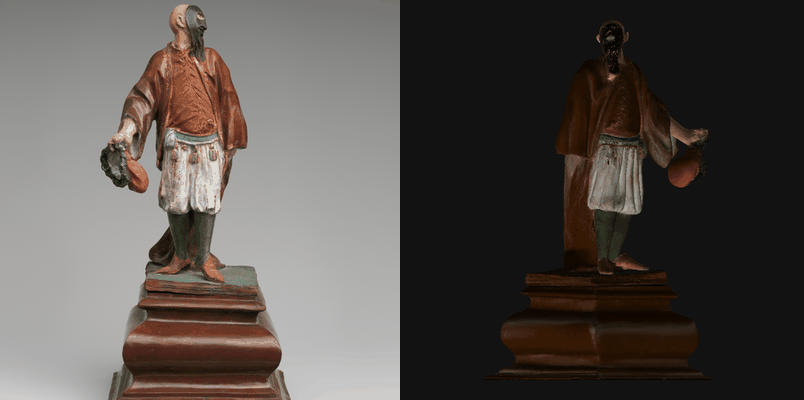
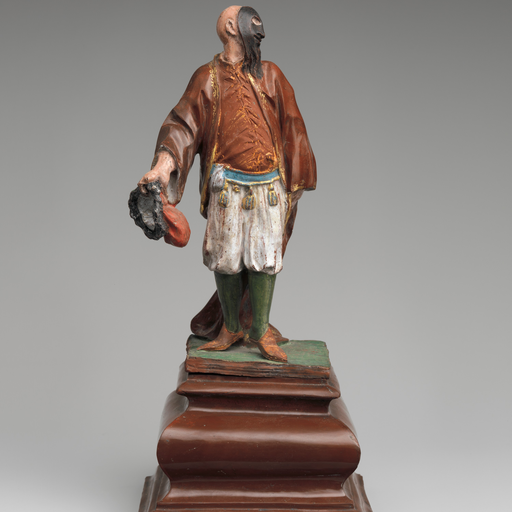
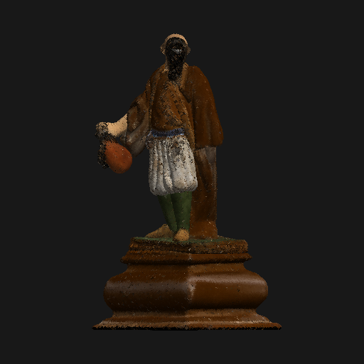
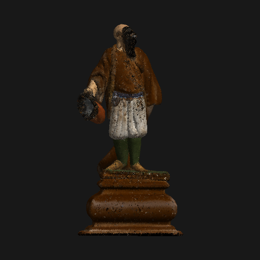
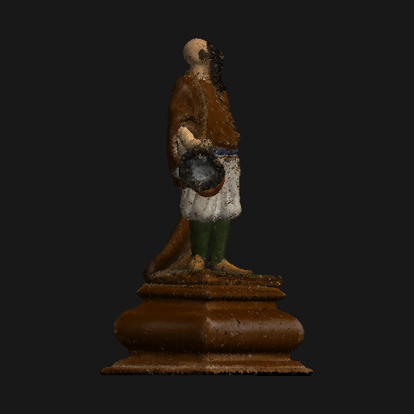
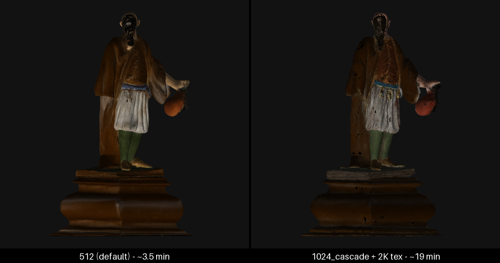
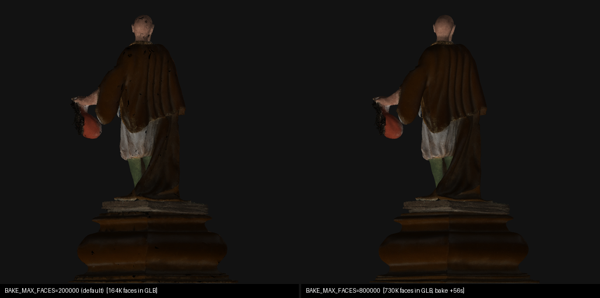

# TRELLIS-Silicon

Run [TRELLIS.2](https://github.com/microsoft/TRELLIS.2) image-to-3D generation natively on Apple Silicon — no NVIDIA GPU required.

TRELLIS.2 is Microsoft Research's state-of-the-art image-to-3D model. It ships CUDA-only. This project runs it on Apple Silicon through PyTorch's MPS backend: a single image in, a textured 400K+-vertex GLB out, entirely on your Mac's GPU.

<p align="center">

</p>

It builds on [trellis-mac](https://github.com/shivampkumar/trellis-mac) by Shivam P Kumar — the original CUDA-to-Apple-Silicon port — and continues independently, packaged as an installable Python project with an additional performance pass (see [Performance](#performance)).

## Results

From a single image, TRELLIS-Silicon generates a **400K+ vertex mesh with baked PBR textures** (base color, metallic, roughness) as a ready-to-use GLB.

On a warm Apple Silicon machine (pipeline type `512`, weights cached, full Metal stack):

- **Pipeline load:** ~19s (once per process)
- **Generation:** ~3 min at the default 12 steps, ~2 min with `--steps 8` (see [fast mode](#fast-mode))
- **Texture bake:** ~10-15s

### Example

**Input image** &rarr; **Generated 3D mesh** (~500K vertices, ~1M triangles) with Metal-baked PBR textures:

<p>




</p>

*Sample image: ["Brighella on a pedestal"](https://www.metmuseum.org/art/collection/search/201769) (1710-13), The Metropolitan Museum of Art — public domain (CC0).*

> Preview images in this README are rendered headless with `tools/render_preview.py`; for interactive inspection open the GLB in Blender or [gltf-viewer](https://gltf-viewer.donmccurdy.com).

## How this differs from trellis-mac

[trellis-mac](https://github.com/shivampkumar/trellis-mac) proved TRELLIS.2 could run on Apple Silicon at all. This project builds on that port and focuses on making it something you can install, trust, and keep using:

- **Packaged** — a src-layout Python package with three console scripts and a Gradio web UI, instead of loose scripts.
- **Reproducible** — TRELLIS.2 pinned to a validated upstream commit, locked Python dependencies, a deterministic verification gate (fixed seed → exact mesh counts), a unit-test suite, and CI on Apple Silicon runners.
- **Faster** — a measurement-first performance pass: conditional checkpoint loading + skip-init (pipeline load ~103s → ~19s warm), batched classifier-free guidance (−7.8% generation), vectorized mesh extraction (67× on that step). Warm end-to-end ~300s → ~197s with unchanged output, ~143s in fast mode.
- **Measured, including the failures** — the optimization campaign documents its dead ends (fused varlen attention kernels, `torch.compile` on MPS, model residency) so nobody re-walks them; see [Performance](#performance).
- **Verified beyond 512** — the `1024` and `1024_cascade` pipelines are exercised on-device, not just theoretically supported.

## Requirements

- macOS on Apple Silicon (M1 or later)
- Python 3.11+
- 24GB+ unified memory recommended (the 4B model is large)
- ~15GB disk space for model weights (downloaded on first run)

## Installation

```bash
git clone https://github.com/sanchez-kim/trellis-silicon.git
cd trellis-silicon

# (Recommended) Download the Xcode Metal Toolchain so setup can build the
# Metal-accelerated texture baker. Without it, setup falls back to a pure-Python
# KDTree baker (slower, slightly softer near UV seams).
xcodebuild -downloadComponent MetalToolchain

# Log into HuggingFace (needed for the gated model weights)
hf auth login

# Request access to these gated models (usually instant approval):
#   https://huggingface.co/facebook/dinov3-vitl16-pretrain-lvd1689m
#   https://huggingface.co/briaai/RMBG-2.0

# Set up everything: create the venv, editable-install the package, clone &
# patch TRELLIS.2, and build the Metal backends when the toolchain is present.
bash setup.sh

source .venv/bin/activate
```

`setup.sh` does an editable install (`uv pip install -e .`), which registers the `trellis-silicon`, `trellis-silicon-web`, and `trellis-silicon-patch` commands.

To skip the Metal build (older hardware, or a faster setup):

```bash
SKIP_METAL=1 bash setup.sh
```

`setup.sh` pre-clones its Git dependencies into `deps/` so all network I/O happens up front. If local clone state looks inconsistent, remove `deps/` and re-run:

```bash
rm -rf deps && bash setup.sh
```

## Usage

```bash
# Basic
trellis-silicon photo.png

# With options
trellis-silicon photo.png --seed 123 --output my_model --pipeline-type 512

# All options
trellis-silicon --help
```

| Option | Default | Description |
|--------|---------|-------------|
| `--seed` | `42` | Random seed for generation |
| `--output` | `output_3d` | Output filename (without extension) |
| `--pipeline-type` | `512` | Pipeline resolution: `512`, `1024`, `1024_cascade` |
| `--texture-size` | `1024` | PBR texture resolution: `512`, `1024`, `2048` |
| `--steps N` | pipeline JSON (usually 12) | Override sampler steps for all three flow phases |
| `--no-texture` | — | Skip texture baking (still exports geometry) |
| `--obj` | — | Also export the untextured, full-resolution OBJ (written before simplification) |
| `--resident` | — | Keep all models resident on MPS instead of shuffling CPU↔MPS per phase. Measured slower on a 24-32GB machine (memory pressure outweighs the saved transfers); may help on 64GB+ |

A GLB with baked PBR textures is the only default output; use `--obj` if you also need the untextured full-resolution mesh.

### Fast mode

Generation time is roughly linear in the sampler step count. Dropping from the default 12 steps to **8** cuts generation by ~39% with quality that is nearly indistinguishable; **6** steps is faster still but visibly noisier on the surface.

```bash
trellis-silicon photo.png --steps 8
```

### Maximum quality

The default `512` pipeline is the speed/quality sweet spot. If you can wait, the higher-resolution pipelines produce ~4× denser raw geometry, and `--texture-size 2048` doubles the texture resolution:

```bash
trellis-silicon photo.png --pipeline-type 1024_cascade --texture-size 2048
```

| | `512` (default) | `1024` | `1024_cascade` |
|---|---|---|---|
| Raw mesh | ~1.0M triangles | ~4.0M | ~4.2M |
| Wall time (warm machine, single indicative runs) | ~3.5 min | ~17 min | ~19 min |

<p>

</p>

At default settings the GLB-level gain is mostly texture fidelity, because every mesh is decimated to 200K faces before baking. That cap is configurable:

```bash
# let up to 800K faces survive into the GLB (measured stable, bake +~50-90s)
BAKE_MAX_FACES=800000 trellis-silicon photo.png --pipeline-type 1024_cascade --texture-size 2048
```

Measured on one M-series/32GB machine (512-pipeline input, 1.06M raw faces): stable at every cap tried — 400K (bake 22s), 600K (30s), 800K (91s), even the full undecimated 1.06M mesh (120s), vs 9s at the default 200K. For `1024_cascade` the difference is dramatic: with `BAKE_MAX_FACES=800000`, 730K faces survive into the GLB instead of 164K — visibly cleaner drapery and far fewer surface pits:

<p>

</p>

The default stays a conservative 200K until higher caps are validated on more machines (the historical "unstable above 800K" behavior of the Metal BVH builder did not reproduce here, but the evidence is one machine, single runs).

Beyond that, two things still cap quality relative to the CUDA original:

- **Hole filling disabled.** Decode-time hole filling needs `cumesh`, whose Metal port crashes on decoder-sized meshes; outputs may have small holes the CUDA path would close.
- **Pre-bake decimation at default settings** — see above; `--obj` exports the full-resolution mesh regardless.

### Web UI

```bash
trellis-silicon-web
```

Opens a local Gradio page (http://127.0.0.1:7860) where you can upload an image, adjust seed / pipeline-type / texture options, and view the generated GLB in an interactive 3D viewer. The pipeline loads lazily on the first Generate click and is cached across generations in the same process.

## Project layout

```
src/trellis_silicon/
  cli.py         # trellis-silicon        — CLI entry point
  webui.py       # trellis-silicon-web     — Gradio UI
  core.py        # shared load + generate + bake pipeline
  backends/      # pure-PyTorch / KDTree fallbacks for the CUDA-only libs
  patches/       # trellis-silicon-patch   — idempotent TRELLIS.2 source patchers
TRELLIS.2/       # upstream checkout (cloned by setup.sh, patched in place)
tools/           # profiling + benchmark scripts
```

TRELLIS.2 itself is not vendored in git; `setup.sh` clones it and `trellis-silicon-patch` (`python -m trellis_silicon.patches`) rewrites its CUDA-only paths in place. Every patch is guarded by a marker string, so re-running is idempotent.

## What was ported

TRELLIS.2 depends on several CUDA-only libraries. Each is replaced with a backend that runs on Apple Silicon:

| Original (CUDA) | Replacement | Purpose |
|---|---|---|
| `flex_gemm` | `mtlgemm` (Pedro Naugusto's Metal port), with `backends/conv_none.py` fallback | Sparse 3D convolution |
| `o_voxel._C` hashmap | `backends/mesh_extract.py` | Mesh extraction from the dual voxel grid (pure PyTorch) |
| `flash_attn` | PyTorch SDPA | Attention for the sparse transformers (padded, not fused) |
| `cumesh` | Skipped during decode | Crashes the Metal port on decoder-sized meshes; replaced by `fast_simplification` before baking |
| `nvdiffrast` | `mtldiffrast` (Metal), with pure-Python fallback | Differentiable rasterization for texture baking |

All hardcoded `.cuda()` calls are patched to use the active device.

### Technical details

**Sparse 3D convolution** (`backends/conv_none.py`): submanifold sparse convolution via a spatial hash of active voxels — gather neighbor features per kernel position, apply weights by matmul, scatter-add back. Neighbor maps are cached per tensor.

**Mesh extraction** (`backends/mesh_extract.py`): reimplements `flexible_dual_grid_to_mesh` without CUDA hashmaps — the coord→index lookup is a collision-free int64 coordinate hash resolved with `torch.unique` + `searchsorted`, then connected voxels per edge and quad triangulation by normal alignment.

**Attention** (patched `full_attn.py`): adds an SDPA backend to the sparse attention module. Variable-length sequences are padded into a batch, run through `torch.nn.functional.scaled_dot_product_attention`, then unpadded.

**Texture baking**: by default the Metal stack from [@pedronaugusto](https://github.com/pedronaugusto) — [`mtldiffrast`](https://github.com/pedronaugusto/mtldiffrast), [`mtlbvh`](https://github.com/pedronaugusto/mtlbvh), [`mtlmesh`](https://github.com/pedronaugusto/mtlmesh), and his CPU fork of [`o_voxel`](https://github.com/pedronaugusto/trellis2-apple) — exposing `o_voxel.postprocess.to_glb`. The decoder mesh is pre-simplified to ~200K faces with `fast_simplification` before the Metal BVH (the builder is unstable on 800K+ face inputs). Without the Metal toolchain, `backends/texture_baker.py` takes over: xatlas UV unwrap, then a scipy cKDTree + inverse-distance weighting over the sparse voxel grid.

## Performance

This project ran a measurement-first optimization campaign on top of the base port. The adopted wins:

| Optimization | Effect | Notes |
|---|---|---|
| Conditional checkpoint loading | load ~103s → ~55-65s | `512` pipeline skips the two unused ~2.4GB `*_1024` flow models |
| Skip-init on load | load ~56s → **~19s** (warm) | The xavier init is immediately overwritten by `load_state_dict`; skipping it is bit-identical. Opt out with `SKIP_INIT_ON_LOAD=0` |
| CFG batching | generation 197.3s → 181.9s (−7.8%) | The two classifier-free-guidance forwards run as one batch-2 forward; mesh is bit-identical. Opt out with `CFG_BATCH=0` |
| Step-count fast mode | generation −39% at `--steps 8` | Quality/speed tradeoff, off by default (see [fast mode](#fast-mode)) |

Both load and generation optimizations are on by default and verified to leave the output mesh unchanged (or, for CFG batching, identical to floating-point rounding). Two paths we investigated and **rejected**: keeping models resident (`--resident` — measured slower from memory pressure), and `torch.compile` (inductor is ~2× slower than eager on MPS in the current PyTorch).

Memory peaks around 18GB of unified memory during generation. The first-ever run also downloads ~15GB of HuggingFace weights (TRELLIS.2, DINOv3, RMBG-2.0), which is network-bound and not counted above.

> **Thermal note.** Apple Silicon throttles aggressively under sustained load. The *same* run can take several times longer when the machine has already been hot for a while — nothing in the code path changes. If a run is unexpectedly slow, let the machine cool for a few minutes and retry before blaming the code. All numbers above assume a cool machine.

## Limitations

- **Hole filling disabled.** Decode-time hole filling needs `cumesh`, whose Metal port segfaults on decoder-sized meshes, so it is skipped. Output meshes may have small holes.
- **Attention is not fused.** Attention runs through PyTorch SDPA rather than a fused Metal kernel. Profiling (`tools/profile_attn.py`) shows dense attention is ~63% of the structure sampling phase, so a flash-style Metal kernel for the *dense* path could still help — but a fused *varlen/sparse* kernel would not: single-image inference is batch-1 with zero padding waste.
- **Pre-simplified before bake.** By default the mesh is decimated to ~200K faces before Metal BVH construction. Raise the cap with `BAKE_MAX_FACES` (see [Maximum quality](#maximum-quality)) or pass `--obj` for the full-resolution mesh (written before simplification).
- **Inference only.** No training support.

## Development

- `tools/profile_attn.py` — instrumented profiling harness for MPS bottlenecks (attention share, CPU fallbacks, per-phase breakdown).
- `tools/bench/` — the benchmark and numerical-sanity scripts behind the optimization campaign (CFG-batching bit-exactness, skip-init verification, load-time splits, the step-comparison renderer).

The package is a standard src-layout project; `uv pip install -e .` gives you the three console scripts and importable `trellis_silicon` package. Set `TRELLIS2_ROOT` to point the patcher/runtime at a non-standard TRELLIS.2 location.

Reproducibility and CI:

- `requirements.lock` pins the exact dependency versions the verification baseline was established with; `setup.sh` installs from it. Upgrading a dependency can shift floating-point behavior (and therefore the deterministic output mesh) even at the same PyTorch version — re-verify after any upgrade.
- `setup.sh` clones TRELLIS.2 at a pinned upstream commit (the one the patches were validated against). Set `TRELLIS2_COMMIT=<sha>` (or `HEAD`) to override.
- `tests/` holds the unit suite (`pytest tests/`), including bit-exactness tests that pin the vectorized mesh extraction against the original dict-based implementation. CI (GitHub Actions, Apple Silicon runners) runs lint, the unit suite, and a patcher idempotency check against the pinned TRELLIS.2 — no model weights involved.

## License

The code in this repository (backends, patches, package, scripts) is released under the MIT License. Upstream model weights carry their own licenses:

- **TRELLIS.2** — [MIT License](https://github.com/microsoft/TRELLIS.2/blob/main/LICENSE)
- **DINOv3** — [Meta custom license](https://huggingface.co/facebook/dinov3-vitl16-pretrain-lvd1689m/blob/main/LICENSE.md) (gated; review before commercial use)
- **RMBG-2.0** — [CC BY-NC 4.0](https://huggingface.co/briaai/RMBG-2.0) (non-commercial; commercial use requires a license from BRIA)

## References

- [trellis-mac](https://github.com/shivampkumar/trellis-mac) by Shivam P Kumar — the direct upstream this project builds on; the original CUDA-to-Apple-Silicon (MPS) port of TRELLIS.2
- [TRELLIS.2](https://github.com/microsoft/TRELLIS.2) by Microsoft Research — the original model and codebase
- [@pedronaugusto](https://github.com/pedronaugusto)'s Metal stack — [`mtldiffrast`](https://github.com/pedronaugusto/mtldiffrast), [`mtlbvh`](https://github.com/pedronaugusto/mtlbvh), [`mtlmesh`](https://github.com/pedronaugusto/mtlmesh), [`mtlgemm`](https://github.com/pedronaugusto/mtlgemm), and the [`trellis2-apple`](https://github.com/pedronaugusto/trellis2-apple) CPU fork of `o_voxel` — the Metal texture-baking and sparse-conv path
- [DINOv3](https://github.com/facebookresearch/dinov3) by Meta — image feature extraction
- [RMBG-2.0](https://github.com/Bria-AI/RMBG-2.0) by BRIA AI — background removal
